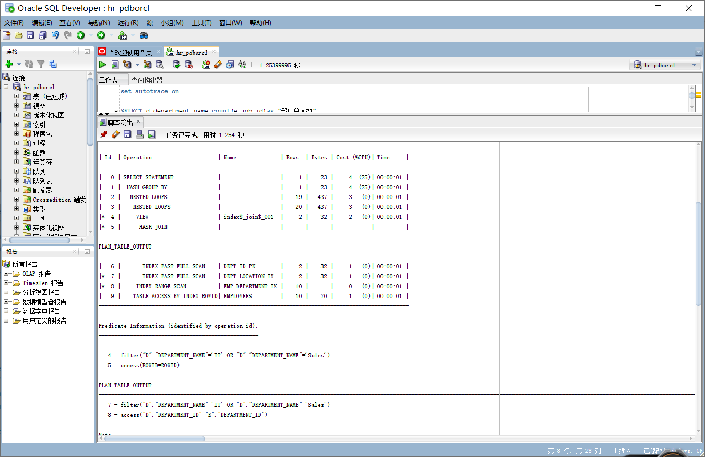
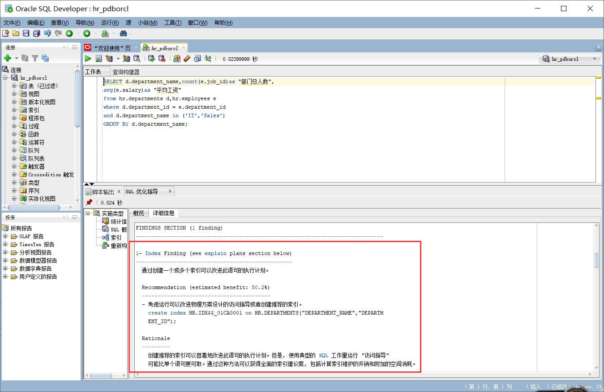
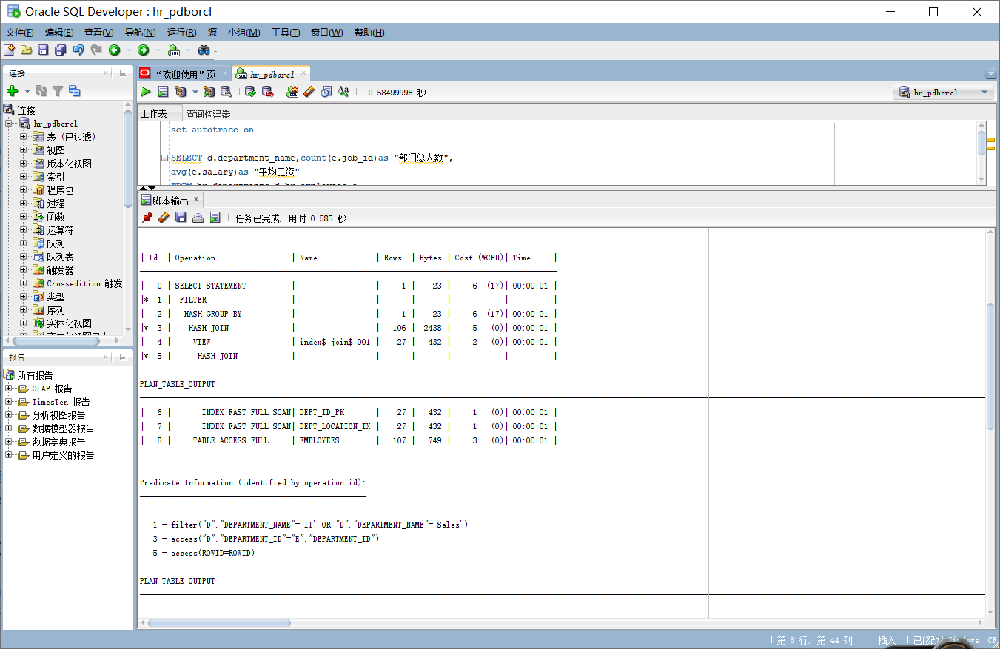

# 实验 1：SQL 语句的执行计划分析与优化指导

## 教材中的查询语句

- 查询 1

  - 运行结果
    
  - 优化建议
    
  - 分析：cost=5，rows=20，谓词信息包括一次索引搜索 access 和一次全表过滤搜索 filter。首先使用 Hash join 索引搜索，获得 row source1，再使用嵌套循环，将 row source1 的数据一行一行的与 B 表的数据比对，最后用 hash group by 将散列结果连接成一张表，最后输出。
    

  - 优化：通过建立索引使语句效率更高，即：在 departments 表上建立一个关于 DEPARTMENT_NAME 和 DEPARTMENT_ID 字段的索引；这样的话就没有 filter,就不必再处理大批量数量，即扫描全表。
    

* 查询 2：

  - 运行结果
    
  - 优化建议
    
  - 分析：cost=7，rows=106，谓词信息包括两次索引搜索 access 和一次全表过滤搜索 filter。使用两次 hash join 查询数据，得到的结果作为 row source1 和 row source2,再用 hash group by 将 row source1 和 row source2 散列数据连接起来，最后用 filter 过滤搜索，得到最终结果。
  - 总结：我认为查询 1 语句是最优语句。运行 sqldeveloper 的优化指导工具后，给出了优化建议。查询 1 是先过滤再汇总（where 语句），参与计算的数据量较小；而查询 2 是先汇总再过滤（having 语句），参与计算的数据量更多。
    

## 设计自己的查询语句：

- 查询两个部门('IT'和'Shipping')的部门总人数和总工资

  - 查询语句：

  ```sql
  set autotrace on

  SELECT d.department_name,count(e.job_id)as "部门总人数",
  sum(e.salary)as "总工资"
  from hr.departments d,hr.employees e
  where d.department_id = e.department_id
  and d.department_name in ('IT','Shipping')
  GROUP BY d.department_name;
  ```

  - 运行结果:
    
  - 分析:cost=4，rows=20，谓词信息包括一次索引搜索 access 和一次全表过滤搜索 filter。
    sql 语句运行过程：首先使用 Hash join 索引搜索，获得 row source1，再使用嵌套循环，将 row source1 的数据一行一行的与 B 表的数据比对，最后用 hash group by 将散列结果连接成一张表，最后获得数据并输出。
    
  - 优化建议：建立索引
    
    优化后可达到 cost=2，rows=20，两次 access 索引搜索，大大提高了搜索效率。
    
