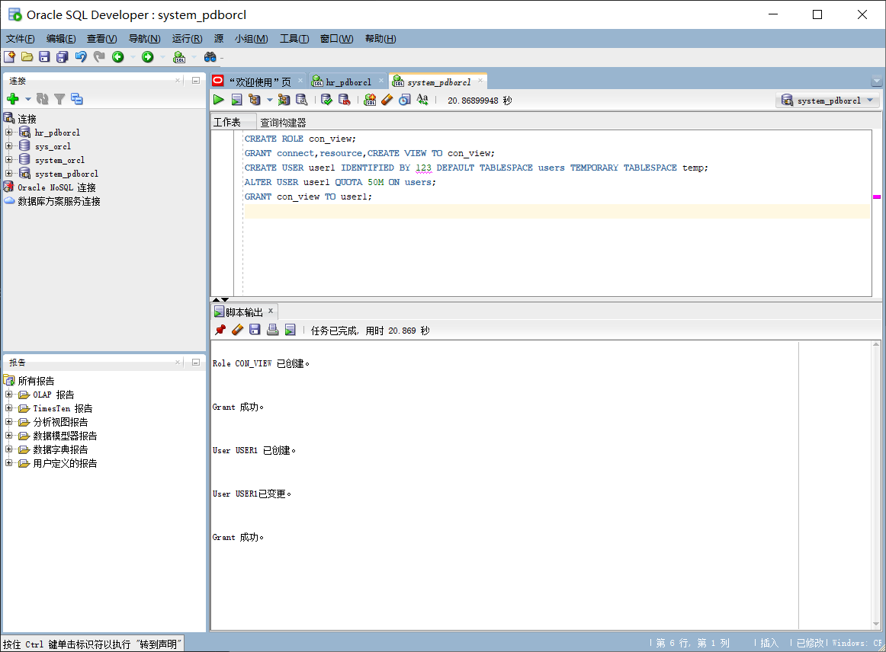
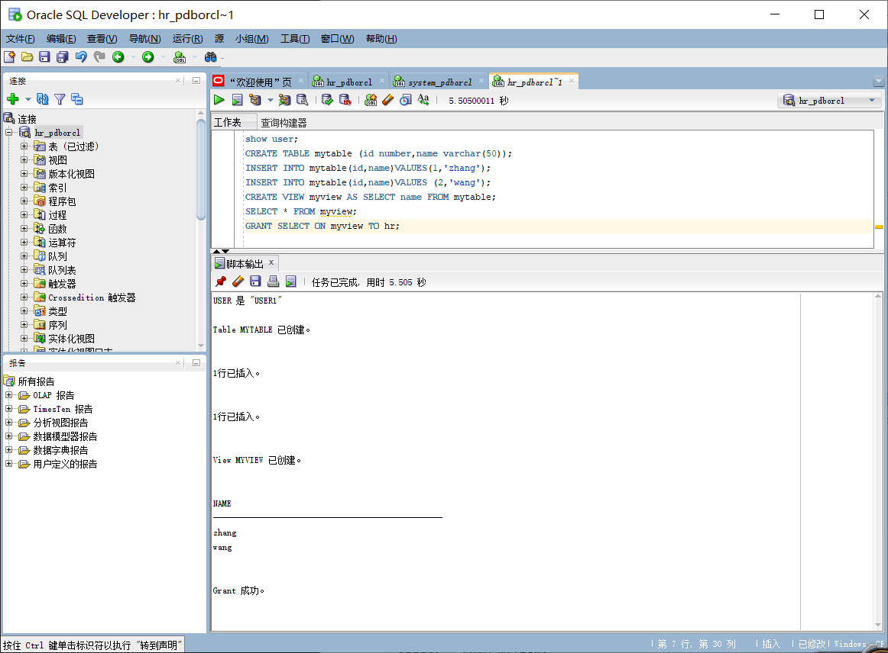
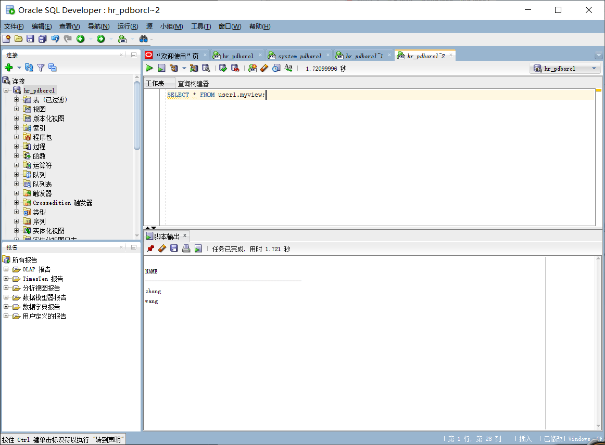
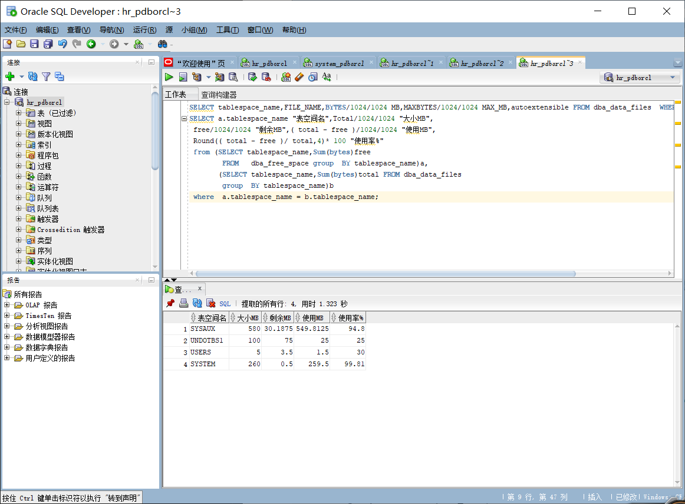

# 实验 2：用户及权限管理

## 个人信息

吴文杰 201810414103 软工 1 班

## 实验目的

掌握用户管理、角色管理、权根维护与分配的能力，掌握用户之间共享对象的操作技能。

## 实验内容

Oracle 有一个开发者角色 resource，可以创建表、过程、触发器等对象，但是不能创建视图。本训练要求：

- 在 pdborcl 插接式数据中创建一个新的本地角色 con_res_view，该角色包含 connect 和 resource 角色，同时也包含 CREATE VIEW 权限，这样任何拥有 con_res_view 的用户就同时拥有这三种权限。
- 创建角色之后，再创建用户 new_user，给用户分配表空间，设置限额为 50M，授予 con_res_view 角色。
- 最后测试：用新用户 new_user 连接数据库、创建表，插入数据，创建视图，查询表和视图的数据。

## 实验参考步骤

对于以下的对象名称 con_res_view，new_user，在实验的时候应该修改为自己的名称。

- 第 1 步：以 system 登录到 pdborcl，创建角色 con_view 和用户 user1，并授权和分配空间：

```sql
CREATE ROLE con_view;
GRANT connect,resource,CREATE VIEW TO con_view;
CREATE USER user1 IDENTIFIED BY 123 DEFAULT TABLESPACE users TEMPORARY TABLESPACE temp;
ALTER USER user1 QUOTA 50M ON users;
GRANT con_view TO user1;
```


语句“ALTER USER user1 QUOTA 50M ON users;”是指授权 user1 用户访问 users 表空间，空间限额是 50M。

- 第 2 步：新用户 user1 连接到 pdborcl，创建表 mytable 和视图 myview，插入数据，最后将 myview 的 SELECT 对象权限授予 hr 用户。

```sql
show user;
CREATE TABLE mytable (id number,name varchar(50));
INSERT INTO mytable(id,name)VALUES(1,'zhang');
INSERT INTO mytable(id,name)VALUES (2,'wang');
CREATE VIEW myview AS SELECT name FROM mytable;
SELECT * FROM myview;
GRANT SELECT ON myview TO hr;
```



- 第 3 步：用户 hr 连接到 pdborcl，查询 user1 授予它的视图 myview

```sql
SELECT * FROM user1.myview;
```



## 查看数据库的使用情况

以下样例查看表空间的数据库文件，以及每个文件的磁盘占用情况。

```sql
SELECT tablespace_name,FILE_NAME,BYTES/1024/1024 MB,MAXBYTES/1024/1024 MAX_MB,autoextensible FROM dba_data_files  WHERE  tablespace_name='USERS';
SELECT a.tablespace_name "表空间名",Total/1024/1024 "大小MB",
 free/1024/1024 "剩余MB",( total - free )/1024/1024 "使用MB",
 Round(( total - free )/ total,4)* 100 "使用率%"
 from (SELECT tablespace_name,Sum(bytes)free
        FROM   dba_free_space group  BY tablespace_name)a,
       (SELECT tablespace_name,Sum(bytes)total FROM dba_data_files
        group  BY tablespace_name)b
 where  a.tablespace_name = b.tablespace_name;
```



- autoextensible 是显示表空间中的数据文件是否自动增加。
- MAX_MB 是指数据文件的最大容量。
